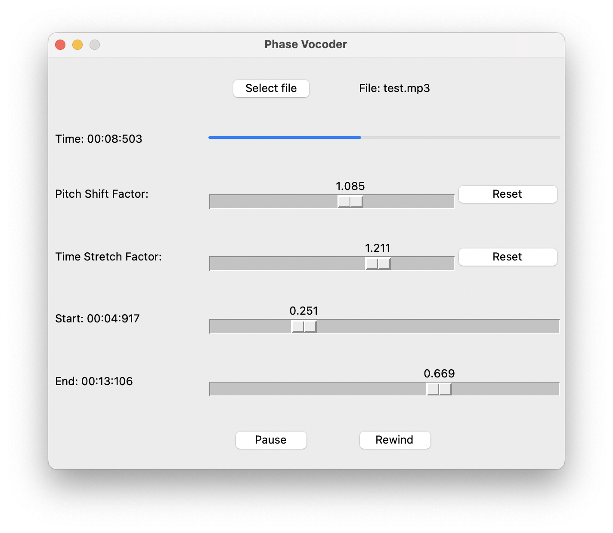

# Implementace algoritmu Phase Vocoder

## Úvod
Tento projekt implementuje audio procesor založený na algoritmu **Phase Vocoder**.  
Program umožňuje v reálném čase upravovat a přehrávat zvukové soubory pomocí time-stretchingu, pitch-shiftingu a smyček (looping).  
Program využívá knihoven **NumPy**, **Sounddevice**, **Soundfile** a **Tkinter** pro grafické rozhraní.  

## Cíl projektu
- Program má být schopen přehrávat audio soubory upravené pomocí algoritmu Phase Vocoder. Hlavní funkce programu jsou:
    1) Time-stretching - změna rychlosti přehrávání bez změny výšky tónu.
    2) Pitch-shifting - změna výšky tónu bez změny délky audio úseku ani rychlosti.
    3) Looping - přehrávání vybraného úseku ve smyčce.
- Uživatel bude moct audio soubor libovolně upravit kombinováním těchto funkcí a následně si ho přehrát.
- Vstupem programu jsou jednotlivé audio soubory ve formátech .mp3, .wav a .flac.
- Výstupem je již upravené audio přehrávané v reálném čase.

## Uživatelská část
- Program se spustí otevřením hlavního souboru main.py, čímž se otevře grafické uživatelské prostředí v okně s názvem "Phase Vocoder".
- Nejprve si uživatel zvolí audio soubor, který chce otevřít.
- V okně je dále několik řádků s ovládacími prvky a informacemi:
    1) Pomocí tlačítka "Select file" uživatel může změnit otevřený zvukový soubor. Vedle tohoto tlačítka se zobrazuje i název vybraného souboru.
    2) Časový kód a progress bar znázorňují, která část souboru se právě přehrává. Všechny zobrazené časové kódy jsou ve formátu: minuty:sekundy:milisekundy
    3) Posuvník s popiskem "Pitch Shift Factor" mění výšku tónu přehrávaného úseku zvuku. Posuvník nijak neovlivňuje délku úseku ani rychlost přehrávání. Hodnoty posuvníku jsou v rozsahu od 0.5 do 1.5 - tedy uživatel může audio snížit o oktávu, nebo zvýšit o kvintu nahoru. Pomocí tlačítka "Reset" se hodnota posuvníku vrátí na hodnotu 1.0.
    4) Posuvník s popiskem "Time Stretch Factor" mění rychlost přehrávání a zachovává přitom výšku tónu a délku časového úseku. hodnoty jsou v rozsahu 0.5–1.5. Tato hodnota udává, kolikrát se změní rychlost přehrávání - například hodnota 0.5 znamená, že audio se přehraje za poloviční čas, tedy bude přehrávané dvojnásobnou rychlostí. Tlačítko "Reset" vedle posuvníku vrátí jeho hodnotu na 1.0.
    5) Posuvníky s popiskem "Start" a "End" umožňují definovat úsek zvuku, který se má přehrávat ve smyčce. Pro přehledný výběr je vedle posuvníků i časový kód odpovídající vybraným mezím. Pokud uživatel zvolí neplatné hodnoty (například když smyčka začíná později, než končí) vrátí se hodnoty posuvníků na poslední platné hodnoty.
    6) Tlačítko "Pause" / "Play" umožňuje spustit nebo pozastavit přehrávání vybraného úseku s vybraným nastavením. Tlačítko "Rewind" vrátí přehrávání na začátek vybraného úseku.
- Upozornění: 
    - Úsek se vždy přehrává ve smyčce. 
    - Změny v nastavení se aplikují vždy až po stisknutí tlačítka "Play". U delších úseků může být po některých změnách čekání na výpočet delší.
    - Pro nejlepší kvalitu je vhodné u parametrů "Time-Stretch Factor" a "Pitch-Shift Factor" používat hodnoty blízké 1.0.
    - Všechny stereo soubory se automaticky nejprve převedou na mono soubory

## Programátorská část
### Struktura programu
- Program je rozvržen do 3 souborů: 
    1) **audio_processing.py** – implementuje třídu *AudioProcessor* s metodami pro úpravu zvuku.
    2) **application.py** – obsahuje třídu *Application* s GUI a logikou přehrávání a změny nastavení
    3) **main.py** – definuje přehrávání pomocí *OutputStream* a spouští hlavní smyčku **Tkinteru**.
- Poznámky:    
    - Application si udržuje informace o nastavení a v atributu *out_data* se ukládá vlastní zvukový úsek, který se pak přehrává na výstupu v **main.py**
    - Indexy *start_index* a *end_index* ohraničují vybraný časový úsek (od 0 až do délky původního souboru - 1) v seznamu původního vstupu.
    - Pro jednodušší přehrávání jsou zde ale i indexy *pb_start_index* a *pb_end_index*, kterými se indexuje stejný úsek v seznamu *out_data* (od 0 do délky *out_data* - 1). Je to proto aby se nemusel časový úsek znovu přepočítat, pokud je již vypočítán v předchozím úseku. V tom případě stačí ponechat *out_data* a pouze změnit indexy *pb_start_index* a *pb_end_index*. Uživatel může zvolit i trochu větší úsek, jelikož při každém přepočítání *out_data* se ve skutečnosti vyhodnotí úsek v rozsahu od (*start_index* - 3 \* sample_rate) do (*end_index* + 3 \* sample_rate), tedy úsek, který je o 3 vteřiny delší z každé strany. Pokud ale uživatel zvolí výrazně delší úsek, nebo úsek ve zcela jiné části souboru, všechny indexy se aktualizují a *out_data* se přepočítá znovu. 
    
### Použité algoritmy a datové struktury
- Zvukové soubory se ukládají jako *numpy.array* s amplitudami v rozsahu [-1.0, 1.0].
- Celé uživatelské prostředí je definováno jako strom, jehož kořen je root definovaný v **main.py**. Dětmi jsou následně jednotlivé grafické prvky (frame a widgety) jako například posuvníky, tlačítka a text. Pomocí metody *grid()* se definuje, kde a jak se mají v okně tyto prvky zobrazit. Některé interaktivní prvky jsou schopné volat jiné metody v *Application*, nebo z nich můžeme extrahovat hodnoty pomocí metody *get()*.
- Nejdůležitější částí programu je samotný algoritmus **Phase Vocoder** s funkcí phase-locking:
    - Vstupní signál se v první fázi rozdělí na překrývající se bloky délky *window_len* s posunem *hop_a* mezi bloky.
    - Na každý blok je aplikována windowing funkce - blok se vynásobí seznamem hodnot, který způsobí, že amplitudy v krajích se zmenší, což zmírňuje defekty ve zvuku v krajních bodech.
    - Pro každý blok se provede Short-Time Fourier Transform (pomocí implementace v **NumPy**).
    - Výsledkem je pak seznam komplexních čísel, který reprezentuje původní signál následovně:
        - Indexy seznamu odpovádají násobkům vzorkovací frekvence (*samplerate*), tedy například index 2 odpovídá frekvenci (2  \* *sample_rate* / *window_len*)
        - Reálné signály na vstupu mají symetrický výstup, proto je použita funkce *rfft()* a výsledný seznam má pouze délku *window_len* / 2 + 1.
        - Absolutní hodnota každého komplexního čísla udává amplitudu každé frekvence
        - Argument komplexního čísla odpovídá fázi, která určuje posun sinusoidy pro danou frekvenci
        - Sečtením všech sinusoid se správnou fází, frekvencí a amplitudou obdržíme zhruba původní signál.
    - Reálný rozklad na frekvence však nemusí odpovídat tomuto diskrétnímu seznamu, proto se na základě posunu fáze mezi jednotlivými bloky spočítá seznam správných frekvencí - *actual_frequency*.
    - Pomocí těchto frekvencí se inverzní funkci *irfft()* syntetizuje nový blok délky *window_len*, na který se opět aplikuje windowing funkce a přidá se do seznamu *result*, ale tentokrát bude posun mezi bloky *hop_s* (daný tím, jak moc se audio natahuje / zkracuje). Tím dostaneme ve výsledku delší, nebo kratší zvukový úsek, ale frekvenční obsah zůstane stejný.
    - Aby zvuk nezněl "roboticky" musí na sebe navazovat fáze jednotlivých frekvencí, proto se na základě *hop_s* a *actual_frequency* přepočítá nová fáze pro syntézu.
    - Pokud je zapnutý *phase-locking*, pak frekvence se silnou amplitudou ovlivňují fáze frekvencí ve svém okolí, což zajišťuje lepší kvalitu a koherenci signálu.
    - Pro bloky s rychlým nárůstem energie (které se detekují pomocí metody *detect_transient()*) se fáze inicializují podle tohoto bloku, čímž se v podstatě algoritmus spustí od začátku. To zaručí, že perkusivní nástroje jsou jasně rozeznatelné.
- Pitch-shifting pak funguje tak, že se na základě nastavení spočítá nový *stretch_factor*, aplikuje se *phase_vocoder()* a pomocí metody *resampling()* se signál převede do nového seznamu tak, že se některé body přeskočí, nebo zkopírují, čímž se zvuk natáhne nebo zkrátí na původní délku. Tímto způsobem se ale i změní výška tónu.

# Zdroje
- https://www.youtube.com/watch?v=fJUmmcGKZMI
- https://citeseerx.ist.psu.edu/document?repid=rep1&type=pdf&doi=4ba26d55ee283b87d5d3b69690482c1ced62578b
